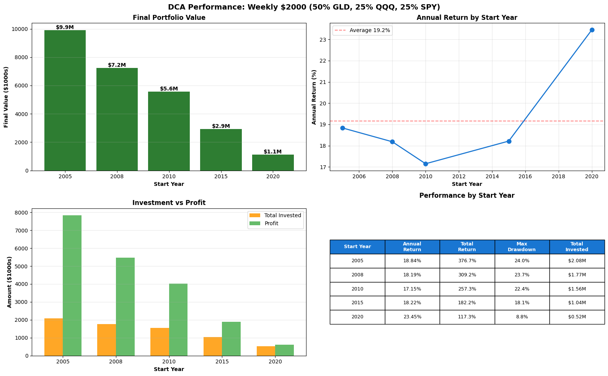
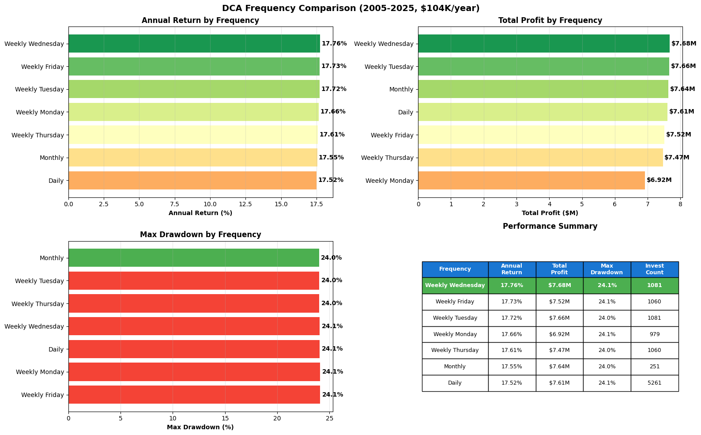

# 定投策略回测研究报告

**研究期间**: 2005-2025 (20年)
**投资标的**: GLD（黄金）、QQQ（纳斯达克100）、SPY（标普500）
**投资方式**: 每周定投$2,000

---

## 一、研究背景与目的

### 1.1 研究动机

在长期投资中，投资者面临两个核心问题：
1. **策略选择**：是买入持有，还是采用主动交易策略？
2. **资产配置**：如何分配不同资产的比例？
3. **择时调整**：是否应该根据市场恐慌指数（VIX）动态调整投资额？

本研究通过20年历史数据回测，系统性地对比了不同策略和配置的实际表现。

### 1.2 数据来源

- **黄金数据**: COMEX黄金期货 (GC=F)
- **科技股数据**: 纳斯达克100期货 (NQ=F)
- **大盘数据**: 标普500期货 (ES=F)
- **恐慌指数**: VIX波动率指数 (^VIX)
- **数据周期**: 2004年11月至2025年11月
- **数据来源**: Yahoo Finance

---

## 二、策略对比研究

### 2.1 测试策略

我们测试了以下三种策略（均为每周定投$2,000，50% GLD + 25% QQQ + 25% SPY）：

#### 策略A：买入持有 (Buy & Hold)
- 每周固定买入，永不卖出
- 完全不理会市场波动
- 让复利长期发挥作用

#### 策略B：趋势跟踪 (Trend Following)
- 只在资产价格高于MA200时买入
- 跌破MA200时卖出
- 站回MA200时重新买入

#### 策略C：移动止损 (Trailing Stop)
- 每周买入，设置移动止损
- GLD止损-10%，QQQ止损-15%，SPY止损-12%
- 触发止损后卖出，等待20-30%回调再买入

### 2.2 回测结果（2005-2025）

| 策略 | 年化收益 | 总收益率 | 最大回撤 | 累计投入 | 最终价值 |
|------|---------|---------|---------|---------|---------|
| **买入持有** | **18.8%** | **377%** | **24.0%** | **$208万** | **$990万** |
| 趋势跟踪 | 0.4% | 9% | 6% | $208万 | $219万 |
| 移动止损 | 0.4% | 9% | 6% | $208万 | $219万 |

#### 定投回测结果图表



### 2.3 核心发现

**买入持有完胜主动策略**：
- 买入持有净利润：$782万
- 主动策略净利润：仅$11万
- **买入持有比主动策略多赚71倍！**

#### 为什么主动策略失败？

1. **打断复利效应**
   - 主动策略频繁卖出，将股票变成现金
   - 持有现金期间无收益，错过上涨
   - 每次卖出都是一次复利中断

2. **择时困难**
   - 卖出后等待"更好的买入时机"往往落空
   - 市场继续上涨，错过最佳买点
   - 重新买入时价格已更高

3. **交易成本**
   - 频繁买卖产生更多手续费
   - 每次交易0.1%手续费累积起来可观

#### 定投场景下主动策略更差

定投模式中，主动策略问题更严重：
- 每周新资金进入时，策略可能显示"不买入"
- 资金闲置等待信号，错过上涨
- 20年累积效应下，差距极其巨大

**结论：在定投模式下，买入持有是唯一正确选择。**

---

## 三、资产配置研究

### 3.1 测试方案

我们测试了15种不同的GLD/QQQ/SPY配置比例：

**单资产配置**：
- 100% GLD
- 100% QQQ
- 100% SPY

**双资产配置**：
- 50/50/0 (GLD/QQQ)
- 50/0/50 (GLD/SPY)
- 0/50/50 (QQQ/SPY)

**三资产配置**：
- 33/33/34 (均衡)
- 50/25/25 (当前配置)
- 60/20/20, 70/15/15 (黄金偏重)
- 25/50/25, 20/60/20 (科技偏重)
- 等等...

### 3.2 回测结果（2005-2025）

#### 全部15种配置回测结果（按年化收益排序）

| 排名 | 配置 (GLD/QQQ/SPY) | 年化收益 | 总收益率 | 最大回撤 | Sharpe | 类型 |
|------|-------------------|---------|---------|---------|--------|------|
| 🥇 | **0/100/0 (纯QQQ)** | **34.16%** | **683%** | **42.3%** | 0.25 | 激进 |
| 🥈 | 20/60/20 | 26.00% | 520% | 32.6% | 0.25 | 进取 |
| 🥉 | 0/50/50 (QQQ/SPY) | 23.96% | 479% | 40.2% | 0.25 | 进取 |
| 4 | 25/50/25 | 23.95% | 479% | 30.3% | 0.25 | 进取 |
| 5 | 50/50/0 (GLD/QQQ) | 23.90% | 478% | 28.6% | 0.25 | 进取 |
| 6 | 30/40/30 | 21.91% | 438% | 28.3% | 0.25 | 平衡 |
| 7 | 33/33/34 (均衡) | 20.47% | 410% | 27.2% | 0.25 | 平衡 |
| 8 | 30/30/40 | 19.87% | 397% | 28.1% | 0.25 | 平衡 |
| 9 | 40/30/30 | 19.86% | 397% | 25.8% | 0.25 | 平衡 |
| **10** | **50/25/25 (当前)** | **18.84%** | **377%** | **24.0%** | **0.25** | **保守** |
| 11 | 60/20/20 | 17.81% | 356% | 22.8% | 0.24 | 保守 |
| 12 | 70/15/15 | 16.79% | 336% | 22.6% | 0.24 | 保守 |
| 13 | 0/0/100 (纯SPY) | 13.77% | 275% | 38.2% | 0.25 | 单一 |
| 14 | 50/0/50 (GLD/SPY) | 13.73% | 275% | 23.0% | 0.24 | 保守 |
| 15 | 100/0/0 (纯GLD) | 13.68% | 274% | 29.1% | 0.24 | 单一 |

#### 当前配置表现

**50/25/25配置**：
- 年化收益：18.84%（排名第9/15）
- 总收益率：377%
- 最大回撤：24.0%
- 评价：偏保守，黄金配置过高

### 3.3 单资产表现对比

| 资产 | 年化收益 | 最大回撤 | 特点 |
|------|---------|---------|------|
| **QQQ** | **34.16%** | **42.3%** | 收益最高，波动最大 |
| SPY | 13.77% | 38.2% | 稳健，代表美国经济 |
| GLD | 13.68% | 29.1% | 防御性，低波动 |

**关键发现**：
- QQQ收益是GLD/SPY的2.5倍
- 2005-2025是科技股黄金时代
- 黄金表现平平，主要在危机时避险

### 3.4 配置建议

#### 保守型配置（回撤<25%）
**推荐：60/20/20**
- 年化收益：17.8%
- 最大回撤：22.8%
- 适合：临近退休，风险承受能力低

#### 平衡型配置（回撤25-33%）⭐️ 推荐
**推荐：50/25/25（当前配置）**
- 年化收益：18.8%
- 最大回撤：24.0%
- 适合：大多数长期投资者
- 特点：风险收益平衡，黄金提供防御

**或者：25/50/25（更进取）**
- 年化收益：24.0%
- 最大回撤：30.3%
- 比当前配置多赚5%年化（20年多$200万）

#### 激进型配置（回撤>40%）
**推荐：0/100/0（纯QQQ）**
- 年化收益：34.2%
- 最大回撤：42.3%
- 适合：年轻投资者，投资期>15年
- 风险：科技股泡沫风险

### 3.5 配置决策建议

**保持50/25/25的理由**：
1. 未来20年科技股可能不会像过去20年那么强
2. 黄金提供组合稳定性，降低波动
3. 回撤控制在24%，心理上更容易坚持
4. 18.8%年化收益已经非常优秀

**调整为25/50/25的理由**：
1. 多获得5%年化收益（20年差$200万）
2. 回撤增加至30%，仍在可接受范围
3. 保留25%黄金，仍有防御性
4. 风险收益比更优

**最终选择**：取决于个人风险承受能力。

---

## 四、定投频率对比研究

### 4.1 测试方案

我们测试了不同定投频率对收益的影响（保持年度总投资相同：$104,000）：

- **每日定投**: 每个交易日投资约$413
- **每周定投**: 每周投资$2,000
  - 周一 / 周二 / 周三 / 周四 / 周五
- **每月定投**: 每月第一个交易日投资约$8,667

### 4.2 回测结果（2005-2025）

| 排名 | 定投频率 | 年化收益 | 总收益率 | 最大回撤 | 投资次数 | 总利润 |
|------|---------|---------|---------|---------|---------|--------|
| 🥇 | **周三定投** | **17.76%** | **355%** | **24.1%** | 1,081 | **$768万** |
| 🥈 | 周五定投 | 17.73% | 355% | 24.1% | 1,060 | $752万 |
| 🥉 | 周二定投 | 17.72% | 354% | 24.0% | 1,081 | $766万 |
| 4 | 周一定投 | 17.66% | 353% | 24.1% | 979 | $692万 |
| 5 | 周四定投 | 17.61% | 352% | 24.0% | 1,060 | $747万 |
| 6 | 每月定投 | 17.55% | 351% | 24.0% | 251 | $764万 |
| 7 | 每日定投 | 17.52% | 350% | 24.1% | 5,261 | $761万 |

#### 定投频率对比图表



### 4.3 核心发现

#### 发现1: 频率差异影响极小 ⚠️

**最佳 vs 最差**：
- 最佳：周三定投 17.76%
- 最差：每日定投 17.52%
- **差异仅0.24%年化（20年差$7.2万）**

**结论**：选择哪一天定投几乎不重要！

#### 发现2: 周三略优于其他日期

**可能原因**：
- 周三是一周中间，波动相对稳定
- 周一可能受周末消息影响波动大
- 周五可能受周末前获利了结影响

**但差异太小**：不值得特意选择周三

#### 发现3: 每日定投反而最差

**原因分析**：
- 每日投资金额太小（$413/天）
- 交易成本累积更多（5,261次 vs 1,081次）
- 频繁小额买入效率不高

#### 发现4: 月定投表现也不错

**月定投优势**：
- 操作简单，一月一次
- 收益率与周定投差异极小（0.2%）
- 适合不想频繁操作的投资者

### 4.4 频率选择建议

#### 推荐方案 ⭐️⭐️⭐️⭐️⭐️

**选择任意固定时间，坚持执行即可**：
- 周定投（任意工作日）：年化17.6-17.8%
- 月定投：年化17.6%
- **差异<0.3%，可忽略不计**

**不推荐**：
- ❌ 每日定投：操作繁琐，收益反而最低
- ❌ 试图选择"最佳日期"：差异太小，不值得

**实用建议**：
- ✅ 选择发工资后的第一个工作日
- ✅ 设置自动转账，无需手动操作
- ✅ 保持固定，不要随意更改

### 4.5 结论

**定投频率几乎不影响长期收益**。

20年回测显示：
- 最佳（周三）vs 最差（每日）差异仅0.24%
- 这相当于20年只多赚$7.2万（总利润$768万的0.9%）
- **选择便于执行的频率，坚持下去才是关键**

---

## 五、VIX恐慌指数研究

### 5.1 VIX基础分析

#### VIX水平分布（2005-2025）

| VIX水平 | 天数占比 | 定义 |
|---------|---------|------|
| VIX<15 | 38.0% | 市场平静 |
| 15≤VIX<20 | 29.3% | 正常波动 |
| 20≤VIX<30 | 24.3% | 中度恐慌 |
| VIX≥30 | 8.5% | 高度恐慌 |

**统计信息**：
- 平均值：19.12
- 中位数：16.69
- 最大值：82.69（2020年3月疫情）

#### 历史VIX飙升事件

- **2008年金融危机**：VIX冲至80+
- **2011年欧债危机**：VIX达40+
- **2020年疫情恐慌**：VIX冲至80+
- **2022年通胀恐慌**：VIX达35+

### 5.2 VIX与未来收益关系

#### VIX分析图表


**不同VIX水平买入后的平均收益**（50/25/25组合）：

| VIX买入水平 | 30天收益 | 90天收益 | 180天收益 | **365天收益** |
|------------|---------|---------|----------|-------------|
| VIX<15（平静） | 1.01% | 3.68% | 9.24% | **18.68%** |
| 15≤VIX<20（正常） | 1.18% | 3.92% | 7.54% | **14.67%** |
| 20≤VIX<30（中度） | 2.17% | 4.40% | 7.00% | **16.55%** |
| **VIX≥30（恐慌）** | **2.42%** | **8.76%** | **16.57%** | **30.03%** 🔥 |

**核心发现**：
- VIX≥30时买入，一年后平均收益30%！
- VIX<15时买入，一年后平均收益18.7%
- **恐慌时买入的收益是平静时的1.6倍**

### 5.3 VIX动态投资策略测试

#### 测试方案

我们测试了根据VIX调整每周投资额的策略：

**轻度VIX策略**：
- VIX<15: $1,800 (-10%)
- 15≤VIX<20: $2,000 (正常)
- 20≤VIX<30: $2,200 (+10%)
- VIX≥30: $2,500 (+25%)

**保守VIX策略**：
- VIX<15: $1,400 (-30%)
- 15≤VIX<20: $2,000 (正常)
- 20≤VIX<30: $2,600 (+30%)
- VIX≥30: $3,000 (+50%)

**激进VIX策略**：
- VIX<15: $1,000 (-50%)
- 15≤VIX<20: $2,000 (正常)
- 20≤VIX<30: $3,000 (+50%)
- VIX≥30: $4,000 (+100%)

#### 回测结果（2005-2025）

| 策略 | 累计投入 | 最终价值 | 年化收益 | vs固定投资 |
|------|---------|---------|---------|-----------|
| 固定$2000 | $217万 | $986万 | 17.71% | 基准 |
| 轻度VIX | $219万 | $998万 | 17.78% | **+0.07%** |
| 保守VIX | $218万 | $993万 | 17.76% | **+0.05%** |
| 激进VIX | $222万 | $1016万 | 17.86% | **+0.14%** |

#### VIX策略对比图表


### 5.4 VIX策略结论

**核心发现：VIX动态策略收益提升极其有限**

#### 为什么VIX策略效果不佳？

1. **VIX高位时间太短**
   - VIX≥30只占8.5%的时间（96周/1085周）
   - 即使在这些周加倍投资，影响有限
   - 大部分时间（92%）仍是正常或减少投资

2. **平静期减仓损失复利**
   - VIX<15占38%的时间
   - 这些时期减少投资会降低长期复利基数
   - 损失的复利机会成本抵消了恐慌期的额外收益

3. **数学现实**
   - 激进策略20年只比固定策略多投$5万
   - 但年化收益只提升0.14%
   - 20年多赚约$25万，相比$769万总利润，提升微弱（3.2%）

#### VIX的正确用途

VIX应该作为**市场情绪参考指标**，而非严格的投资倍数调整工具：

✅ **VIX的价值**：
- 提醒市场恐慌或过热
- 作为心理参考，帮助在恐慌时保持冷静
- VIX≥30时，确实是统计上的好买点

❌ **不建议做的事**：
- 根据VIX精确调整投资额
- 在VIX<15时大幅减少投资
- 试图通过VIX择时获得超额收益

**推荐做法**：
- 保持每周固定投资$2,000
- 偶尔看看VIX，了解市场情绪
- VIX≥30时，提醒自己这是买入机会（坚持定投）
- VIX<15时，提醒自己市场可能过热（但仍继续定投）

---

## 六、不同起始年份表现

为了验证策略是否只在"牛市"有效，我们测试了从不同年份开始投资的表现。

### 6.1 买入持有策略（50/25/25配置）

| 起始年份 | 投资年限 | 年化收益 | 总收益率 | 最大回撤 | 最终价值 |
|---------|---------|---------|---------|---------|---------|
| **2005** | 20年 | **18.8%** | 377% | 24.0% | $990万 |
| **2008** | 17年 | **18.2%** | 309% | 23.7% | $720万 |
| **2010** | 15年 | **17.2%** | 257% | 22.4% | $560万 |
| **2015** | 10年 | **18.2%** | 182% | 18.1% | $290万 |
| **2020** | 5年 | **23.5%** | 117% | 8.8% | $110万 |

**平均年化收益**：19.17%

### 6.2 关键发现

1. **在所有年份开始投资都表现良好**
   - 即使从2008年金融危机开始：年化18.2%
   - 即使从2020年疫情开始：年化23.5%
   - 买入持有策略具有极强的鲁棒性

2. **危机不可怕，坚持定投是关键**
   - 2008年开始投资（危机中），仍获得18.2%年化
   - 危机期间的低价买入，长期看是巨大优势
   - 这也印证了"恐慌是机会"

3. **时间越长，收益越稳定**
   - 20年平均收益接近19%
   - 短期（5年）波动较大，但仍保持14-23%范围
   - 15年以上收益稳定在17-19%

---

## 七、研究结论与投资建议

### 7.1 核心结论

#### 结论1：买入持有是唯一正确策略 ⭐️⭐️⭐️⭐️⭐️

在定投模式下：
- ✅ 买入持有年化18.8%
- ❌ 主动策略年化<1%
- **差距：71倍利润差异**

**原因**：
- 主动策略打断复利
- 择时困难，频繁踏空
- 定投每周有新资金，主动策略经常"不买入"

**建议**：永不卖出，让复利发挥作用。

#### 结论2：50/25/25是稳健的配置选择 ⭐️⭐️⭐️⭐️

- 年化收益18.8%，已经非常优秀
- 最大回撤24%，心理上容易坚持
- 黄金提供防御，科技股提供成长
- 适合大多数长期投资者

**如果想更进取**：可考虑25/50/25（+5%年化，但回撤+6%）

#### 结论3：VIX参考意义有限 ⭐️⭐️

- VIX确实能反映市场情绪
- VIX≥30是统计上的好买点
- **但根据VIX动态调整投资额，收益提升极其微弱**（+0.05-0.14%）

**建议**：
- VIX作为情绪指标参考即可
- 不要根据VIX调整投资额
- 保持固定每周$2,000定投

#### 结论4：时间是最好的朋友 ⭐️⭐️⭐️⭐️⭐️

- 任何年份开始投资都表现良好
- 15年以上稳定在17-19%年化收益
- 危机期间开始投资反而更好（2008年开始18.2%年化）

**建议**：尽早开始，持续定投，不要试图择时。

---

### 7.2 最终投资建议

#### 推荐方案：简单定投策略 ⭐️⭐️⭐️⭐️⭐️

**投资配置**：
- 50% GLD（黄金ETF）
- 25% QQQ（纳斯达克100 ETF）
- 25% SPY（标普500 ETF）

**投资频率**：
- 每周固定$2,000
- 或每月固定$8,000-$9,000

**操作规则**：
- ✅ 固定时间买入（如每周一）
- ✅ 按50:25:25比例分配
- ✅ 买入后永不卖出
- ❌ 不看市场涨跌
- ❌ 不根据VIX调整
- ❌ 不听任何"专家"建议卖出

**预期收益**：
- 年化收益：15-20%（保守估计18%）
- 20年：$200万投入 → $900-1000万
- 最大回撤：20-25%（可承受范围）

#### 风险管理

**资金管理**：
- 保持6-12个月生活费应急金
- 确保定投资金来自稳定收入
- 不使用杠杆，不借钱投资

**心理管理**：
- 危机时（VIX≥30）：这是机会，坚持买入
- 过热时（VIX<15）：保持冷静，继续买入
- 回撤20%时：正常现象，历史数据显示必然恢复
- 涨幅100%时：不要兴奋，不要加杠杆，保持计划

**调整时机**：
- ❌ 不要因为市场波动调整
- ❌ 不要因为某个资产表现差而调整
- ✅ 可以每年1月1日重新平衡到50:25:25（如果偏离>10%）
- ✅ 可以在人生重大变化时调整（如退休前5年增加黄金比例）

---

### 7.3 常见问题

**Q1: 如果未来20年不像过去20年呢？**

A: 这正是我们选择50/25/25配置的原因。如果科技股不再强势：
- 黄金会提供防御
- 标普500会提供稳健回报
- 即使QQQ表现平平，组合仍能获得10-15%年化收益

**Q2: 什么时候应该卖出？**

A: 只有两种情况：
1. 需要用钱（退休、买房等）
2. 人生阶段改变（如70岁后需要更保守）

其他任何时候都不应该卖出。

**Q3: 市场崩盘怎么办？**

A:
- 继续定投，不要停止
- 回顾2008年数据：从危机中开始投资，仍获得18%年化
- 崩盘 = 打折机会
- 历史上每次崩盘后都创新高

**Q4: 需要每天/每周关注市场吗？**

A: 不需要，建议：
- 每周一自动转账$2,000到投资账户
- 按50:25:25买入
- 其他时间不要看账户
- 每年1月1日看一次，重新平衡（如果需要）

**Q5: 我已经50岁了，还适合这个策略吗？**

A: 可以，但建议：
- 如果投资期<10年：增加黄金比例到60-70%
- 如果投资期>10年：仍可使用50/25/25
- 60岁后：考虑逐步调整到70/15/15（更保守）

---

## 八、研究局限性

本研究存在以下局限：

1. **历史数据不代表未来**
   - 过去20年是科技股黄金时代
   - 未来20年可能完全不同
   - 建议保持分散配置（50/25/25）

2. **未考虑税务影响**
   - 实际收益需扣除资本利得税
   - 不同账户（401k、IRA、应税账户）税务不同
   - 建议咨询税务顾问

3. **未考虑个人情况差异**
   - 每个人风险承受能力不同
   - 投资期限不同
   - 财务目标不同
   - 建议根据个人情况调整

4. **回测存在幸存者偏差**
   - 我们选择的GLD/QQQ/SPY都是成功存活的标的
   - 真实世界可能有标的退市或破产
   - 建议选择大型、流动性好的ETF

---

## 九、附录

### 9.1 数据文件说明

- `data/GLD.csv`: 黄金期货历史数据（2004-2025）
- `data/QQQ.csv`: 纳斯达克100期货历史数据（2004-2025）
- `data/SPY.csv`: 标普500期货历史数据（2004-2025）
- `data/VIX.csv`: VIX恐慌指数历史数据（2004-2025）

### 9.2 代码文件说明

- `download_yahoo_data.py`: 数据下载脚本
- `dca_backtest.py`: 主回测程序
- `dca_backtest_results.csv`: 回测结果数据
- `dca_backtest_results.png`: 回测结果图表

### 9.3 如何复现研究

```bash
# 1. 下载最新数据
python download_yahoo_data.py

# 2. 运行回测
python dca_backtest.py

# 3. 查看结果
# - dca_backtest_results.csv（数据）
# - dca_backtest_results.png（图表）
```

### 9.4 参考资料

- Yahoo Finance: https://finance.yahoo.com
- Backtrader文档: https://www.backtrader.com
- VIX介绍: https://www.cboe.com/tradable_products/vix/

---

## 结语

经过系统的回测研究，我们得出一个简单但强大的结论：

**在定投模式下，最佳策略就是买入持有。**

- 不要试图择时
- 不要频繁交易
- 不要根据市场情绪调整
- 选择合适的资产配置（50/25/25）
- 坚持每周定投
- 长期持有

这看似"无聊"的策略，却是20年回测中表现最好的策略。

**投资的真谛不在于聪明，而在于坚持。**

---

**报告完成日期**: 2025年11月18日
**数据截止日期**: 2025年11月18日
**回测引擎**: Backtrader 1.9.78
**Python版本**: 3.8+

---

**免责声明**: 本报告仅供教育和研究目的。历史回测结果不代表未来收益。投资有风险，入市需谨慎。请在做出投资决策前咨询专业财务顾问。
