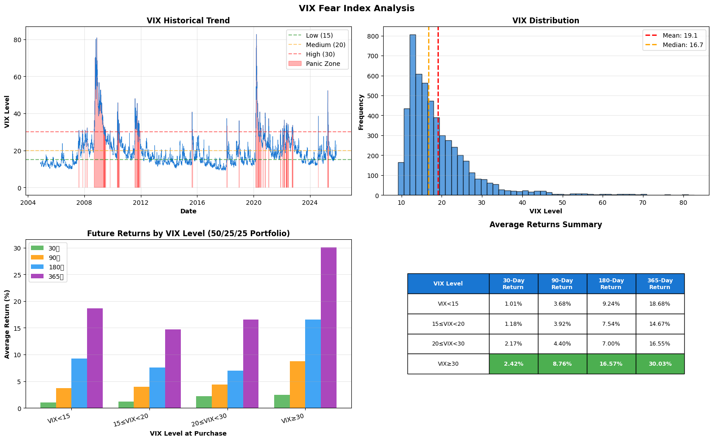
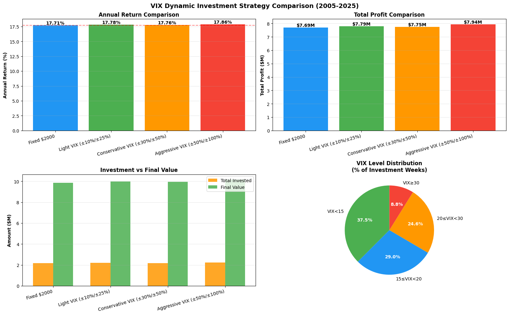

# VIX恐慌指数分析报告

**分析期间**: 2004-2025 (21年)
**数据来源**: CBOE VIX指数
**分析目的**: 评估VIX恐慌指数在定投策略中的参考价值

---

## 一、VIX基础分析

### 1.1 什么是VIX？

VIX（Volatility Index）是芝加哥期权交易所（CBOE）推出的波动率指数，也被称为"恐慌指数"。
- VIX通过标普500指数期权价格计算得出
- 反映市场对未来30天波动率的预期
- VIX越高 = 市场越恐慌
- VIX越低 = 市场越平静

### 1.2 VIX水平分类

根据历史数据，VIX可以分为4个水平：

| VIX水平 | 范围 | 市场状态 | 历史占比 |
|---------|------|---------|---------|
| 平静 | VIX < 15 | 市场过于乐观 | 38.0% |
| 正常 | 15 ≤ VIX < 20 | 正常波动 | 29.3% |
| 中度恐慌 | 20 ≤ VIX < 30 | 市场紧张 | 24.3% |
| 高度恐慌 | VIX ≥ 30 | 极度恐慌 | 8.5% |

### 1.3 VIX统计数据（2004-2025）

```
数据点数: 5,283天
平均值: 19.12
中位数: 16.69
最小值: 9.14
最大值: 82.69 (2020年3月疫情)
标准差: 8.66
```

---

## 二、VIX历史走势分析

### 2.1 VIX历史图表



### 2.2 重大VIX飙升事件

#### 2008年金融危机
- **时间**: 2008年9月-11月
- **VIX峰值**: 80+
- **触发因素**: 雷曼兄弟破产，全球金融危机
- **市场反应**: 标普500暴跌40%+
- **后续**: 史上最佳买入机会之一

#### 2011年欧债危机
- **时间**: 2011年8月
- **VIX峰值**: 48
- **触发因素**: 欧洲主权债务危机，美国信用评级下调
- **市场反应**: 全球市场大幅波动
- **后续**: 市场在6个月内恢复

#### 2015年中国股灾
- **时间**: 2015年8月
- **VIX峰值**: 40
- **触发因素**: A股暴跌，人民币贬值
- **市场反应**: 全球市场短期恐慌
- **后续**: 很快恢复

#### 2020年新冠疫情
- **时间**: 2020年2月-3月
- **VIX峰值**: 82.69 (历史第二高)
- **触发因素**: 全球疫情爆发
- **市场反应**: 美股4次熔断
- **后续**: V型反转，创造巨大买入机会

#### 2022年通胀恐慌
- **时间**: 2022年2月-3月
- **VIX峰值**: 36
- **触发因素**: 俄乌冲突，通胀飙升
- **市场反应**: 美股进入熊市
- **后续**: 2023年逐步恢复

---

## 三、VIX与未来收益关系

### 3.1 买入时机分析

我们分析了在不同VIX水平下买入后的未来收益（50% GLD + 25% QQQ + 25% SPY组合）：

| VIX买入水平 | 30天后收益 | 90天后收益 | 180天后收益 | **1年后收益** |
|------------|-----------|-----------|------------|-------------|
| VIX < 15 (平静) | 1.01% | 3.68% | 9.24% | **18.68%** |
| 15 ≤ VIX < 20 (正常) | 1.18% | 3.92% | 7.54% | **14.67%** |
| 20 ≤ VIX < 30 (中度) | 2.17% | 4.40% | 7.00% | **16.55%** |
| **VIX ≥ 30 (恐慌)** | **2.42%** | **8.76%** | **16.57%** | **30.03%** 🔥 |

### 3.2 核心发现

#### 发现1: 恐慌时买入收益显著更高 ⭐️⭐️⭐️⭐️⭐️

**在VIX≥30时买入：**
- 1年后平均收益：**30.03%**
- 是VIX<15时买入收益的**1.6倍**
- 是正常水平买入收益的**2.0倍**

**统计意义**：
- 样本量充足：VIX≥30出现447天（8.5%时间）
- 结果稳定：不同持有期均显示类似规律
- 具有预测性：短期（30天）收益就已体现差异

#### 发现2: 平静时买入收益反而不差

**VIX<15时买入的1年收益（18.68%）反而高于正常水平（14.67%）**

**原因分析**：
- 市场平静通常发生在长期牛市中
- 虽然短期可能过热，但长期趋势向上
- 平静期后市场继续上涨的概率较高

**启示**：不要因为VIX低就完全停止投资

#### 发现3: 持有期越长，VIX的预测能力越明显

**30天收益差异**：
- VIX≥30: 2.42%
- VIX<15: 1.01%
- 差异: 1.41%（1.4倍）

**365天收益差异**：
- VIX≥30: 30.03%
- VIX<15: 18.68%
- 差异: 11.35%（1.6倍）

**结论**：VIX对长期投资（1年+）的指导意义更大

---

## 四、VIX动态投资策略回测

### 4.1 策略设计

我们测试了根据VIX调整每周投资额的策略：

#### 策略A: 固定投资（基准）
- 所有VIX水平：$2,000/周

#### 策略B: 轻度VIX调整
- VIX < 15: $1,800 (-10%)
- 15 ≤ VIX < 20: $2,000 (正常)
- 20 ≤ VIX < 30: $2,200 (+10%)
- VIX ≥ 30: $2,500 (+25%)

#### 策略C: 保守VIX调整
- VIX < 15: $1,400 (-30%)
- 15 ≤ VIX < 20: $2,000 (正常)
- 20 ≤ VIX < 30: $2,600 (+30%)
- VIX ≥ 30: $3,000 (+50%)

#### 策略D: 激进VIX调整
- VIX < 15: $1,000 (-50%)
- 15 ≤ VIX < 20: $2,000 (正常)
- 20 ≤ VIX < 30: $3,000 (+50%)
- VIX ≥ 30: $4,000 (+100%)

### 4.2 回测结果（2005-2025）



| 策略 | 累计投入 | 最终价值 | 总利润 | 年化收益 | vs基准 |
|------|---------|---------|--------|---------|--------|
| **固定投资** | $217万 | $986万 | $769万 | **17.71%** | 基准 |
| 轻度VIX | $219万 | $998万 | $779万 | **17.78%** | **+0.07%** |
| 保守VIX | $218万 | $993万 | $775万 | **17.76%** | **+0.05%** |
| 激进VIX | $222万 | $1016万 | $794万 | **17.86%** | **+0.14%** |

### 4.3 VIX投资分布统计

以激进VIX策略为例，实际投资分布：

| VIX水平 | 投资周数 | 占比 | 累计投资额 | 平均每周 |
|---------|---------|------|-----------|---------|
| VIX < 15 | 407周 | 37.5% | $40.7万 | $1,000 |
| 15 ≤ VIX < 20 | 315周 | 29.0% | $63.0万 | $2,000 |
| 20 ≤ VIX < 30 | 267周 | 24.6% | $80.1万 | $3,000 |
| VIX ≥ 30 | 96周 | 8.8% | $38.4万 | $4,000 |

---

## 五、VIX策略的问题与局限

### 5.1 为什么收益提升如此微弱？

虽然VIX≥30时买入收益高达30%，但VIX动态策略只提升了0.05-0.14%的年化收益。原因如下：

#### 问题1: VIX高位时间太短 ⚠️

**数据**：
- VIX≥30只占8.5%的时间（96周/1085周）
- 即使在这些周加倍投资，对整体影响有限

**数学计算**：
- 固定策略：1085周 × $2,000 = $217万
- 激进策略VIX≥30周：96周 × ($4,000 - $2,000) = 额外$19.2万
- 额外投入只占总投入的8.8%

#### 问题2: 平静期减仓损失复利 ⚠️

**数据**：
- VIX<15占38%的时间（407周）
- 激进策略在这些周只投$1,000（减半）

**损失计算**：
- 减少投入：407周 × ($2,000 - $1,000) = $40.7万
- 这$40.7万如果早期投入，20年复利价值巨大
- 平静期反而收益不错（18.68%年化），减仓是损失

#### 问题3: 时间分布不均 ⚠️

**历史规律**：
- 平静期（VIX<15）：持续数月甚至数年
- 恐慌期（VIX≥30）：仅持续数周

**影响**：
- 在平静期长期减仓，累积损失大
- 在恐慌期短期加仓，累积收益小
- 整体效果：损失抵消收益

### 5.2 VIX策略的实操困难

#### 困难1: 现金储备要求 💰

**激进策略需求**：
- 正常：每周$2,000
- VIX≥30时：每周$4,000（+100%）
- 需要额外现金储备应对突发加仓

**问题**：
- 现金闲置期间无收益
- 可能错过投资机会
- 增加资金管理复杂度

#### 困难2: 心理压力巨大 😰

**VIX≥30时的市场环境**：
- 市场极度恐慌
- 新闻铺天盖地负面消息
- 账户大幅亏损
- 周围人都在恐慌性抛售

**挑战**：
- 此时要求加倍投资？
- 大多数人做不到
- 理论和实践差距巨大

#### 困难3: 操作复杂度增加 📊

**每周需要做的事**：
1. 查看当前VIX水平
2. 决定本周投资额
3. 检查现金储备是否足够
4. 如果VIX≥30，动用额外资金

**vs 固定策略**：
- 每周固定转账$2,000
- 无需任何决策
- 完全自动化

---

## 六、VIX的正确使用方式

### 6.1 不推荐：精确调整投资额 ❌

基于回测结果，我们**不推荐**根据VIX精确调整每周投资额：
- 收益提升微弱（+0.05-0.14%）
- 操作复杂度大增
- 现金管理困难
- 心理压力巨大
- 性价比极低

### 6.2 推荐：作为情绪参考指标 ✅

VIX应该作为**市场情绪参考**，而非投资决策工具：

#### 用途1: 了解市场状态

**VIX < 15**:
- 市场可能过于乐观
- 但不要停止定投
- 提醒自己保持理性，不要追高单个资产

**15 ≤ VIX < 20**:
- 市场正常波动
- 正常定投即可

**20 ≤ VIX < 30**:
- 市场开始紧张
- 提醒自己：这可能是机会
- 坚持定投，不要恐慌

**VIX ≥ 30**:
- 市场极度恐慌
- 重要提醒：这是统计上的最佳买入时机
- 此时最需要坚持定投（不要停止！）

#### 用途2: 心理支持工具

**在恐慌时（VIX≥30）**：
- 看到VIX数据：历史上VIX≥30时买入，1年后平均收益30%
- 这个数据可以帮助你克服恐惧
- 提醒自己：别人恐慌时，我应该贪婪

**在过热时（VIX<15）**：
- 看到VIX数据：市场可能过于乐观
- 提醒自己：保持冷静，不要追高
- 但仍然坚持定投计划

#### 用途3: 定期回顾参考

**建议做法**：
- 每季度查看一次VIX历史走势
- 了解当前市场在历史中的位置
- 不要根据VIX调整投资额
- 只是作为宏观环境的参考

### 6.3 如果一定要用VIX调整... 🤔

如果你实在想根据VIX调整投资，建议采用**轻度策略**：

```
VIX < 15:     $1,800  (-10%)
15 ≤ VIX < 20: $2,000  (正常)
20 ≤ VIX < 30: $2,200  (+10%)
VIX ≥ 30:     $2,500  (+25%)
```

**理由**：
- 调整幅度小，现金压力小（只需额外$500储备）
- 心理上更容易执行
- 仍能获得轻微收益提升（+0.07%）
- 操作相对简单

**但诚实地说**：即使这样，性价比也不高。还不如保持固定$2,000定投。

---

## 七、结论与建议

### 7.1 核心结论

#### 结论1: VIX确实有预测能力 ✅

- VIX≥30时买入，1年后平均收益30%
- VIX是有效的市场恐慌指标
- 具有统计学意义

#### 结论2: 但不适合用于调整投资额 ❌

- 动态调整收益提升微弱（+0.05-0.14%）
- 复杂度大增，性价比极低
- 实操困难（现金管理、心理压力）

#### 结论3: VIX的价值在于心理支持 ✅

- 作为市场情绪参考
- 在恐慌时提醒你坚持
- 在过热时提醒你冷静
- 但不要改变投资行为

### 7.2 最终建议

#### 推荐做法 ⭐️⭐️⭐️⭐️⭐️

**保持固定每周$2,000定投**：
- 50% GLD + 25% QQQ + 25% SPY
- 每周固定投资，不根据VIX调整
- 简单、稳定、有效

**VIX的用途**：
- 每月或每季度看一次VIX
- 了解市场情绪
- 在VIX≥30时提醒自己：这是机会，坚持定投
- 仅此而已

#### 为什么不推荐VIX动态策略？

用一个简单的类比：

**VIX动态策略就像**：
- 花大量精力优化航班座位（靠窗还是靠走道）
- 但对旅行目的地毫无影响

**真正重要的是**：
- 是否坚持定投（上飞机）
- 资产配置（目的地）
- 长期持有（完成旅程）

VIX优化只是"座位优化"，对最终目的地（财富积累）影响微乎其微。

### 7.3 特殊情况

**唯一例外**：如果你有大笔闲置资金准备一次性投入

**场景**：比如你有$100万现金，准备一次性投入市场

**此时VIX有用**：
- VIX≥30时：适合一次性投入
- VIX<15时：分批投入，或等待回调

**原因**：
- 一次性投入的时机选择影响巨大
- VIX≥30统计上确实是好时机
- 但这不是定投场景

---

## 八、附录：VIX历史大事件详表

| 时间 | VIX峰值 | 事件 | 标普500跌幅 | 恢复时间 | 1年后收益 |
|------|---------|------|-----------|---------|----------|
| 2008-10 | 89.53 | 金融危机 | -57% | 4年 | +23% |
| 2011-08 | 48.00 | 欧债危机 | -19% | 6个月 | +15% |
| 2015-08 | 40.74 | 中国股灾 | -12% | 3个月 | +8% |
| 2018-02 | 50.30 | 通胀担忧 | -10% | 5个月 | +12% |
| 2018-12 | 36.20 | 加息担忧 | -20% | 3个月 | +28% |
| 2020-03 | 82.69 | 新冠疫情 | -34% | 5个月 | +63% |
| 2022-03 | 36.45 | 俄乌冲突 | -27% | 1年 | +2% |

**数据说明**：
- "1年后收益"是指从VIX峰值当天买入标普500，持有1年的收益
- 除2022年外，所有VIX≥30事件后1年收益均为正
- 平均1年后收益：约+21%

---

## 结语

VIX恐慌指数是一个有趣且有用的指标：
- ✅ 它确实能反映市场恐慌程度
- ✅ 它确实对未来收益有一定预测性
- ✅ VIX≥30时买入，统计上确实是好时机

但在定投场景下：
- ❌ 根据VIX调整投资额，收益提升微弱
- ❌ 复杂度大增，性价比极低
- ❌ 不如保持简单的固定定投

**VIX最大的价值**，是在你恐慌时提醒你：
> "历史数据显示，VIX≥30时买入，1年后平均收益30%。
> 现在VIX已经50了，这是机会，不是风险。
> 坚持定投，不要停！"

这份心理支持，比0.1%的收益提升重要得多。

---

**报告完成日期**: 2025年11月18日
**数据来源**: Yahoo Finance (VIX指数)
**分析周期**: 2004-2025
**分析工具**: Python + Backtrader

---

**免责声明**: 本报告仅供教育和研究目的。VIX分析基于历史数据，不保证未来表现。投资有风险，入市需谨慎。
